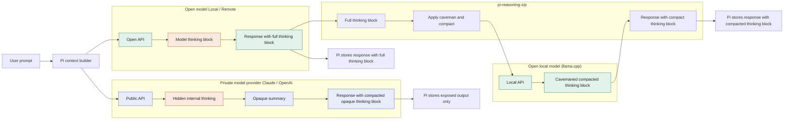

# MermaidJS Diagrams

live here because NPM does not support mermraid rendering in README, so diagrams live here and manually rendered and to media directory, so they can be linked to README as images

### Open vs CLosed thinking

Diagram shows comaprison fo Open and Closed thinking/reasoning block flow and what ends up in harness and context.

