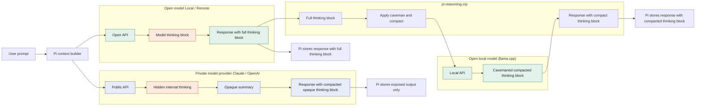

<p align="center">
  
</p>

# pi-reasoning-zip

<p>
  <a href="https://www.npmjs.com/package/pi-reasoning-zip">
    
  </a>
  <a href="https://www.npmjs.com/package/pi-reasoning-zip">
    
  </a>
  <a href="LICENSE">
    
  </a>
  <a href="https://pi.dev/packages/pi-reasoning-zip">
    
  </a>
</p>

Compress reasoning blocks to keep the context short.


## Why

There are `thinking` blocks in your Pi session filling your context window. But there is a major difference between **open** and **closed** models.
- Hosted providers of **closed models** usually keep full internal reasoning inside the API and expose only final response and summarized opaque `thinking` block. 
- The _**open reasoning models**_ usually expose the whole `thinking` block to Pi.

`pi-reasoning-zip` compresses _**open reasoning model**_ `thinking` blocks into a caveman-style compact thinking block before they are stored in the session.
- caveman-ed compaction costs additional tokens but reduces context usage
- intentional usage of `pi-reasoning-zip` is when your Pi is using local model, in which case your `reasoningZip.compactor` is often the same as your active Pi model




## Install

```bash
# From npm, after publish
pi install npm:pi-reasoning-zip

# From git
pi install git:github.com/Ryu-CZ/pi-reasoning-zip

# Development
npm install
npm run check
npm run smoke
```

For local development you can also load the readable source extension directly:

```bash
pi -e ./extensions
```

The npm library entrypoint still builds to `dist/index.js`, but Pi package metadata points at `./extensions` so Pi can inspect the source it loads.

## Features

- **Forward-only compaction** — modifies only the new assistant message being finalized.
- **Stored compact traces** — future turns naturally replay compact `thinking` because that is what Pi stored.
- **Local compactor** — calls a configured OpenAI-compatible `/chat/completions` endpoint directly.
- **llama.cpp-first targeting** — defaults to llama.cpp-like providers such as `llama-server=http://127.0.0.1:7484`.
- **Prompt minimization** — optional grug-style request injection for target local providers.
- **Fail-open safety** — preserves original messages on errors, timeouts, invalid output, or unknown payloads.
- **Opaque reasoning guard** — skips signed, encrypted, signature-bearing, redacted, or provider-opaque reasoning metadata.

## Commands

None.

`pi-reasoning-zip` works through Pi lifecycle hooks:

| Hook | Purpose |
|---|---|
| `message_end` | Compact eligible new assistant `thinking` blocks before storage |
| `before_provider_request` | Optionally inject terse-reasoning guidance for target local providers |

## Configuration

Settings live in project `.pi/settings.json` or global `~/.pi/agent/settings.json` under the `reasoningZip` key. Project settings take precedence.

```json
{
  "reasoningZip": {
    "enabled": true,
    "mode": "llama-only",
    "storageMode": "compact-new",
    "compressionRole": "grug",
    "injectPrompt": true,
    "compactor": {
      "baseUrl": "http://127.0.0.1:7484/v1",
      "model": "unsloth",
      "apiKey": "sk-placeholder",
      "maxTokens": 512,
      "temperature": 0.1,
      "timeoutMs": 30000
    },
    "thresholds": {
      "minChars": 1000,
      "maxTraceChars": 2000
    }
  }
}
```

### Modes

| Mode | Behavior |
|---|---|
| `llama-only` | Compact llama.cpp-like providers only |
| `local-only` | Compact local URL providers and llama.cpp-like providers |
| `all` | Compact any eligible plain Pi `thinking` block |
| `disabled` | No-op |

### Storage modes

| Storage mode | Behavior |
|---|---|
| `compact-new` | Compact new assistant thinking before storage |
| `off` | Do not alter assistant messages |

### Compression roles

| Role | Behavior |
|---|---|
| `balanced` | concise bullets while preserving extra context |
| `grug` | terse, keyword-heavy default |
| `ultra-grug` | most aggressive fragment-style trace |

## Compactor endpoint

The compactor must expose an OpenAI-compatible chat completions endpoint:

```text
POST {baseUrl}/chat/completions
```

The extension first sends `chat_template_kwargs: { "enable_thinking": false }` so llama.cpp/Qwen-style compactor calls return the compact trace in `message.content` instead of spending tokens on compactor-side reasoning. If a stricter OpenAI-compatible endpoint rejects that extra field with HTTP 400/422, the request is retried once without it.

The extension asks the compactor to produce terse output like:

```text
facts:
- ...
decisions:
- ...
constraints:
- ...
failed:
- ...
next:
- ...
```

The configured `compressionRole` guides the compactor's terse style. If the compactor returns `none`, empty output, output longer than the original, or output over `thresholds.maxTraceChars`, the original block is preserved.

## Safety model

This extension does **not**:

- rewrite previous sessions
- backfill older entries in the current session
- mutate replayed context with the `context` hook
- claim to reduce hidden provider-side reasoning tokens
- touch signed, encrypted, or opaque provider reasoning metadata

It skips:

- non-assistant messages
- messages without array content
- short thinking below `thresholds.minChars`
- signature-bearing or redacted thinking blocks
- unknown providers by default in `llama-only`
- hosted/non-local providers in `local-only`

## Smoke tests

Automated local smoke test:

```bash
npm run smoke
```

This loads `dist/index.js`, registers the Pi hooks against a mock extension API, uses a temporary `.pi/settings.json`, mocks the OpenAI-compatible compactor, and verifies thinking compaction plus targeted prompt injection.

Manual Pi smoke test:

1. Start a local llama.cpp/OpenAI-compatible server that can compact text.
2. Configure `reasoningZip.compactor.baseUrl` and `reasoningZip.compactor.model`.
3. Enable `mode: "llama-only"` and use a llama.cpp provider in Pi.
4. Ask a prompt that produces long visible reasoning/thinking.
5. Inspect the session JSONL.
6. Confirm the new assistant message contains compact `thinking`, not raw verbose reasoning.
7. Confirm older session entries were not changed.
8. Send another prompt and confirm Pi replays the compact trace because that is what was stored.

## Development

```bash
npm run typecheck
npm test
npm run build
npm run check
npm run smoke
pi -e ./extensions --no-extensions --offline --list-models
npm pack --dry-run
```

## Release checklist

1. Update the version in `package.json` and `package-lock.json`.

   ```bash
   npm version <patch|minor|major> --no-git-tag-version
   ```

2. Move completed `CHANGELOG.md` entries from `[Unreleased]` to the new version section.

   ```md
   ## [Unreleased]

   ## [x.y.z] - YYYY-MM-DD
   ```

3. Update changelog links at the bottom.

   ```md
   [Unreleased]: https://github.com/Ryu-CZ/pi-reasoning-zip/compare/vx.y.z...HEAD
   [x.y.z]: https://github.com/Ryu-CZ/pi-reasoning-zip/compare/vprevious...vx.y.z
   ```

   For the first release, link the version to the release page:

   ```md
   [0.1.0]: https://github.com/Ryu-CZ/pi-reasoning-zip/releases/tag/v0.1.0
   ```

4. Verify build, source-extension load, smoke test, package contents, and npm publish metadata.

   ```bash
   npm run check
   npm run smoke
   pi -e ./extensions --no-extensions --offline --list-models
   npm pack --dry-run
   npm publish --dry-run
   ```

5. Commit and tag the release.

   ```bash
   git add package.json package-lock.json CHANGELOG.md
   git commit -m "chore: release vx.y.z"
   git tag -a vx.y.z -m "vx.y.z"
   ```

6. Push branch and tag.

   ```bash
   git push origin main
   git push origin vx.y.z
   ```

7. Publish to npm when ready.

   ```bash
   npm publish
   ```
